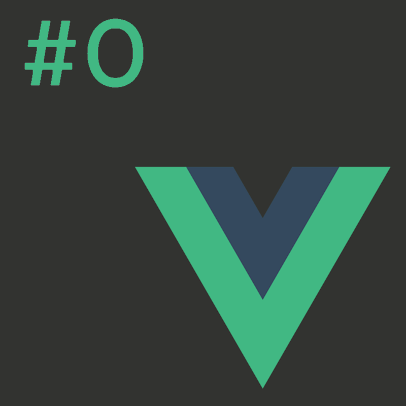
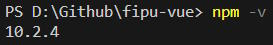

# Programiranje u skriptnim jezicima
**Nositelj**: doc. dr. sc. Nikola Tanković  
**Asistenti**:
- Luka Blašković, univ. bacc. inf.
- Alesandro Žužić, univ. bacc. inf.

**Ustanova**: Sveučilište Jurja Dobrile u Puli, Fakultet informatike u Puli

</img>

# [1] Vue.js - Osnove i postavljanje aplikacije
[comment]: <> (Ažurirati sliku - logovue/vue0.png)
</img>

U ovoj vježbi proći ćemo kroz sve osnovne komponente vue.js okvira te ćemo instalirati sve potrebne preduvjete za kreiranje aplikacije.

Vue je JavaScript okvir za izradu korisničkih sučelja. Temelji se na standardnom HTML-u, CSS-u i JavaScriptu te pruža deklarativni i komponentni model programiranja koji pomaže u učinkovitom razvoju korisničkih sučelja, bila ona jednostavna ili složena.

## Sadržaj

<!-- TOC start (generated with https://github.com/derlin/bitdowntoc) -->

- [Programsko inženjerstvo](#programsko-inženjerstvo)

 

## 1.1 Instalacija

### Koraci:
1. Instalirati [node.js](https://nodejs.org/) i provjeriti jeli instaliran s naredbom `node` u Comsmand Promptu.
 
</img>
 
U slučaju da komanda ne radi, treba najvjerojatnije restartirati računalo da se pravilno postave/ažuriraju node PATH varijable (Windows).
2. Instalirati **Vue3** koristeći **Vite** alat za izgradnju
